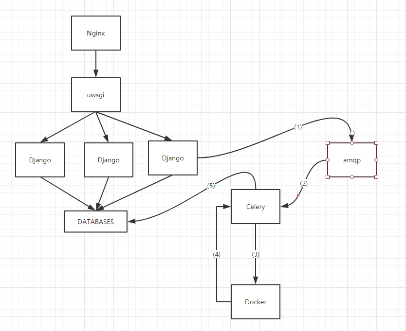

#### 说明

    一个简单的存储资源分配系统
    接收用户端请求，为用户申请 MySQL 与 Redis 两类资源
    资源的连接、鉴权等信息应该随机生成

#### 设计思路:

    使用 Django + Django-rest-framework 接受前端请求并鉴权
    通过 RabbitMQ 作为后端的 Celery 作为异步任务队列
    操作 docker(docker-py)

    为避免循环依赖, 未开启 redis 作为 backend, 同时使用数据库为 sqlite
    如有需求请修改 setting.py 启动 redis 和mysql 作为存储

#### 环境依赖:

    # ubuntu-18.04.2-live-server-amd64
    apt-get install libmysqlclient-dev python3-dev python3-pip

    pip3 install -r requirements.txt

    python3 manage.py migrate
    python3 manage.py makemigrations api
    # 输入用户名密码, 邮箱可跳过
    python3 manage.py createsuperuser
    python3 manage.py migrate

    docekr pull redis:latest
    docekr pull mysql:latest

#### 启动

    # 为方便调试
    python3 manage.py runserver
    # uwsgi --http :8000 --module carton.wsgi
    # 如果使用 nginx 需要先 移动静态文件 python3 manage.py collectstatic

    sudo apt install python3-celery-common

    # 启动 celery
    celery -A carton worker -l info

    # windows 环境中
    # pip3 install eventlet
    # celery -A carton worker -l info --pool=eventlet

    # 启动 rabbitmq
    # 请修改setting中对应的密码
    docker run -d -p 127.0.0.1:5672:5672 -e RABBITMQ_DEFAULT_USER=user -e RABBITMQ_DEFAULT_PASS=password rabbitmq

#### 注意

    启动python(如用nginx,uwsgi也需要加入) 时需要 将对应用户加入docker组

    默认情况每个app数据存储于 /data/(uuid)/

